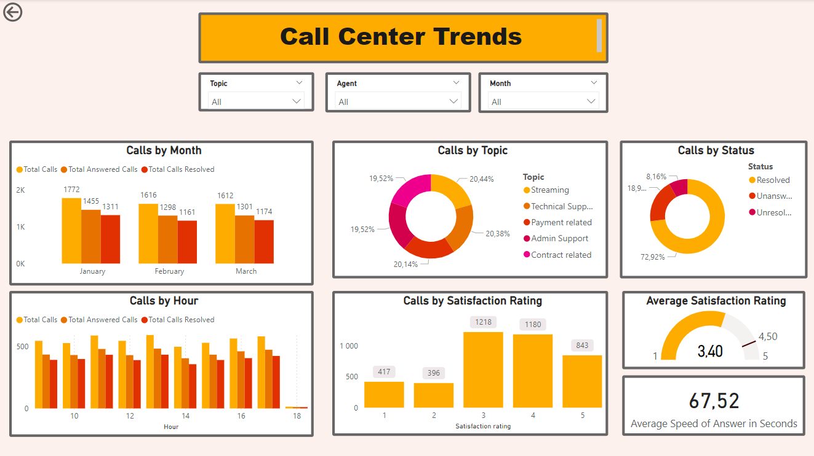
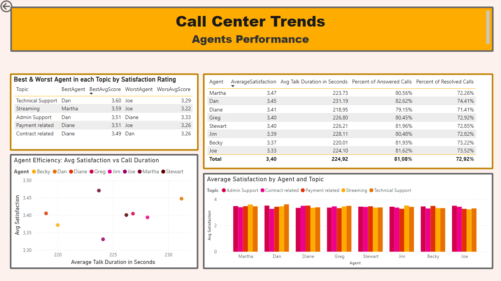

# Call Center Dashboard Documentation

This project is a part of the [Forage PwC Switzerland Power BI Job Simulation](https://www.theforage.com/simulations/pwc-ch/power-bi-cqxg). 


This Power BI dashboard was built to analyze call center performance across various dimensions, including agent performance, call handling efficiency, and customer satisfaction. The dataset consists of several key fields related to calls, and multiple visualizations were created to help stakeholders monitor and assess performance.

## Dataset Overview

The dataset used for this dashboard contains the following columns:
- **Call ID**: Unique identifier for each call.
- **Agent**: The name of agent handling the call.
- **Date**: Date of the call.
- **Time**: Time the call was received.
- **Topic**: Topic of the call.
- **Answered (Y/N)**: Whether the call was answered (Yes/No).
- **Resolved**: Whether the issue was resolved (Yes/No).
- **Speed of Answer in Seconds**: Time taken to answer the call in seconds.
- **Avg Talk Duration**: Average duration of the call.
- **Satisfaction Rating**: Customer satisfaction rating for the call on scale frpm 1 to 5.

## Data Transformation

1. **Transforming Data Types**: 
    - Converted the `Time` and `Avg Talk Duration` columns to the **Time datatype** for accurate analysis and calculations.

## Overview Page Visualizations



### 1. **Slicers**
   - Three slicers are available to filter the data:
     1. **Agent**: Filter by agent name.
     2. **Topic**: Filter by the call topic.
     3. **Month**: Filter by month.
    
### 2. **Clustered Column Chart: Calls by Month**
   - **X-Axis**: Date (Month).
   - **Y-Axis**: Total Calls, Total Answered Calls, and Total Calls Resolved.
   
   **DAX measures for :**
   - **Total Calls Resolved**:
       ```DAX
       Total Calls Resolved = CALCULATE(COUNT(Sheet1[Call ID]), Sheet1[Resolved] = "Y")
       ```
   - **Total Answered Calls**:
     ```DAX
     Total Answered Calls = CALCULATE(COUNT(Sheet1[Call ID]), Sheet1[Answered (Y/N)] = "Y")
     ```
   - **Total Calls**:
     ```DAX
     Total Calls = COUNT(Sheet1[Call ID])
     ```
- **Conclusion**: 
  The chart shows a steady flow of calls across January to March, with only slight variations in total calls, answered calls, and resolved calls. There is a consistent handling of calls each month.

### 3. **Clustered Column Chart: Total Calls by Hour**
   - **X-Axis**: Hour (calculated column).
   - **Y-Axis**: Total Calls, Total Answered Calls, and Total Calls Resolved.

   **DAX formula for Hour**:
   ```DAX
   Hour = HOUR(Sheet1[Time])
   ```
- **Conclusion**: 
  Based on the consistent call volume of around 500 calls per hour throughout the day, with a significant drop in calls around 18:00, it’s clear that there isn’t a typical peak period requiring additional staffing. Instead, the focus should be on effectively managing resources during the lower volume hours to ensure efficiency and maintain service quality.

### 4. **Donut Chart: Calls by Topic**
   - **Values**: Total Calls.
   - **Legend**: Topic of the call.
   - **Note**: Values are displayed as a percentage of the total calls.
   - **Conclusion**: 
The calls are almost evenly distributed across different topics, with no single topic dominating the majority.

### 5. **Column Chart: Calls by Satisfaction Rating**
   - **X-Axis**: Satisfaction Rating.
   - **Y-Axis**: Count of Call ID.
   - **Conclusion**:
    Most satisfaction ratings fall between 3 and 4, indicating that customers generally view their experience as average, but there is significant room for improvement. Few ratings reach 5 (high satisfaction), suggesting that the service is not consistently exceeding expectations.
     
### 6. **Donut Chart: Calls by Status**
   - Created a calculated column to combine the `Answered` and `Resolved` columns into a **Status** field using the following DAX formula:
     ```DAX
     Status = 
     VAR Answered = [Answered (Y/N)]
     VAR Resolved = [Resolved]
     RETURN
         SWITCH(
             TRUE(),
             Answered = "Y" && Resolved = "Y", "Resolved",
             Answered = "Y" && Resolved = "N", "Unresolved",
             Answered = "N", "Unanswered",
             "Unknown"
         )
     ```
   - **Legend**: Status (Resolved, Unresolved, Unanswered).
   - **Values**: Total calls.
   - **Conclusion**:
  While a promising 72.92% of calls are resolved, the troubling statistics show that 18.92% remain unanswered and 8.16% are unresolved, indicating that nearly one in four calls is not effectively addressed. To enhance customer satisfaction, it is essential to focus on reducing these unanswered and unresolved calls. Given the consistent call volume throughout the month, hiring additional agents could be a strategic solution to ensure all calls are managed effectively, thereby improving overall service quality and satisfaction ratings.

### 7. **Average Satisfaction Rating (KPI)**
   - **Displays**: The average satisfaction rating, with minimum and maximum values.
   - **Target**: A target average rating of 4.5 is displayed, which can be adjusted if necessary.
   - **Conclusion**:  The average satisfaction rating is 3.40, which leaves room for improvement.
     
### 8. **Average Speed of Answer in Seconds (Card)**
   - **Displays**: The average speed of answer in seconds.
   - **Conclusion**: The average time to answer calls is 67.52 seconds, which could indicate that customers are experiencing delays before reaching an agent. Reducing this time should be prioritized to improve the overall customer experience and potentially increase the satisfaction rating.


## Agents Performance Page



This page provides detailed insights into the performance of individual agents. It includes various metrics like satisfaction rating, talk duration, and call resolution percentages. Below are the visualizations present on this page:

### 1. **Agent Performance Metrics Table**
The table provides a detailed overview of each agent's average metrics. The differences in performance metrics are minimal, suggesting a generally uniform level of service, making it challenging to identify a clear best or worst performer.
   - **Columns**:
     1. **Agent**: Displays the name of the agent.
     2. **Average Satisfaction**: 
        ```DAX
        AverageSatisfaction = AVERAGE('Sheet1'[Satisfaction rating])
        ```
     3. **Avg Talk Duration in Seconds**: Duration of the calls in seconds, created using the following formula:
         ```DAX
         Avg Talk Duration in Seconds = 
           HOUR(Sheet1[Avg Talk Duration]) * 3600 + 
           MINUTE(Sheet1[Avg Talk Duration]) * 60 + 
           SECOND(Sheet1[Avg Talk Duration])
         ```
     4. **Percent of Answered Calls**: 
        ```DAX
        Percent of Answered Calls = ([Total Answered Calls] / [Total Calls])
        ```
     5. **Percent of Resolved Calls**: 
        ```DAX
        Percent of Resolved Calls = ([Total Calls Resolved] / [Total Calls])
        ```

### 2. **Scatter Plot: Agent Efficiency (Avg Satisfaction vs Call Duration)**
   - **X-Axis**: Avg Talk Duration in Seconds.
   - **Y-Axis**: Average Satisfaction.
   - **Legend**: Agent.

   This scatter plot visually compares agents' average satisfaction scores against their call handling duration, providing insights into efficiency. The scatter plot reveals no discernible trend. For instance, Dan, who has the highest average satisfaction rating, also has the longest average call duration. Conversely, Diane maintains a high satisfaction rating while exhibiting the shortest average call duration. This lack of correlation suggests that both call length and customer satisfaction may be influenced by other factors absent in the dataset.

### 3. **Clustered Column Chart: Average Satisfaction by Agent and Topic**
   - **X-Axis**: Agent.
   - **Y-Axis**: Average Satisfaction.
   - **Legend**: Topic.

   This clustered column chart allows for comparison of average satisfaction scores across agents and topics. The clustered column chart indicates that average satisfaction ratings are fairly evenly distributed across agents for different topics. No single agent stands out as significantly better or worse in any specific area, reinforcing the notion of minimal differences in average satisfaction ratings across agents.


### 4. **Table: Best & Worst Agent in each Topic by Satisfaction Rating**
   To delve deeper into agent performance, the table highlights the best and worst agents in each topic by satisfaction rating. Notably, Dan consistently achieves the highest ratings in both administrative and technical support topics. In contrast, Joe ranks as the lowest in satisfaction across three out of five topics, including payment-related issues, streaming, and technical support. This suggests that management could benefit from strategically assigning agents like Dan to areas where they excel while providing additional support and training for agents like Joe to enhance their performance.

#### Step-by-Step Creation:

1. **Calculated Table for Agent Satisfaction by Topic**:
   ```DAX
   AgentSatisfactionByTopic = 
   SUMMARIZE(
       Sheet1, 
       Sheet1[Topic], 
       Sheet1[Agent],
       "AvgSatisfactionScore", AVERAGE(Sheet1[Satisfaction rating])
   )
   ```
2. **Measures**:
   - **BestAgent**:
     ```DAX
     BestAgent = 
     IF(
         AgentSatisfactionByTopic[AvgSatisfactionScore] = AgentSatisfactionByTopic[MaxSatisfactionScorePerTopic],
         AgentSatisfactionByTopic[Agent],
         BLANK()
     )
     ```

   - **WorstAgent**:
     ```DAX
     WorstAgent = 
     IF(
         AgentSatisfactionByTopic[AvgSatisfactionScore] = AgentSatisfactionByTopic[MinSatisfactionScorePerTopic],
         AgentSatisfactionByTopic[Agent],
         BLANK()
     )
     ```

   - **MinSatisfactionScorePerTopic**:
     ```DAX
     MinSatisfactionScorePerTopic = 
     CALCULATE(
         MIN(AgentSatisfactionByTopic[AvgSatisfactionScore]),
         ALLEXCEPT(AgentSatisfactionByTopic, AgentSatisfactionByTopic[Topic])
     )
     ```

   - **MaxSatisfactionScorePerTopic**:
     ```DAX
     MaxSatisfactionScorePerTopic = 
     CALCULATE(
         MAX(AgentSatisfactionByTopic[AvgSatisfactionScore]),
         ALLEXCEPT(AgentSatisfactionByTopic, AgentSatisfactionByTopic[Topic])
     )
     ```

3. **Second Table for Best & Worst Agents**:
   This table combines the best and worst agents along with their satisfaction scores per topic.

   ```DAX
   MinMaxSatisfactionByTopicAgent = 
   SUMMARIZE(
       AgentSatisfactionByTopic,
       AgentSatisfactionByTopic[Topic],
       "BestAgent", MAXX(FILTER(AgentSatisfactionByTopic, NOT(ISBLANK(AgentSatisfactionByTopic[BestAgent]))), AgentSatisfactionByTopic[BestAgent]),
       "BestAgentAvgScore", MAX(AgentSatisfactionByTopic[AvgSatisfactionScore]),
       "WorstAgent", MAXX(FILTER(AgentSatisfactionByTopic, NOT(ISBLANK(AgentSatisfactionByTopic[WorstAgent]))), AgentSatisfactionByTopic[WorstAgent]),
       "WorstAgentAvgScore", MIN(AgentSatisfactionByTopic[AvgSatisfactionScore])
   )
   ```

4. **Table Display**:
   The table is displayed with the following columns:
   - **Topic**: The topic of the call.
   - **BestAgent**: Agent with the highest average satisfaction score for that topic.
   - **BestAgentAvgScore**: Average satisfaction score of the best agent.
   - **WorstAgent**: Agent with the lowest average satisfaction score for that topic.
   - **WorstAgentAvgScore**: Average satisfaction score of the worst agent.

