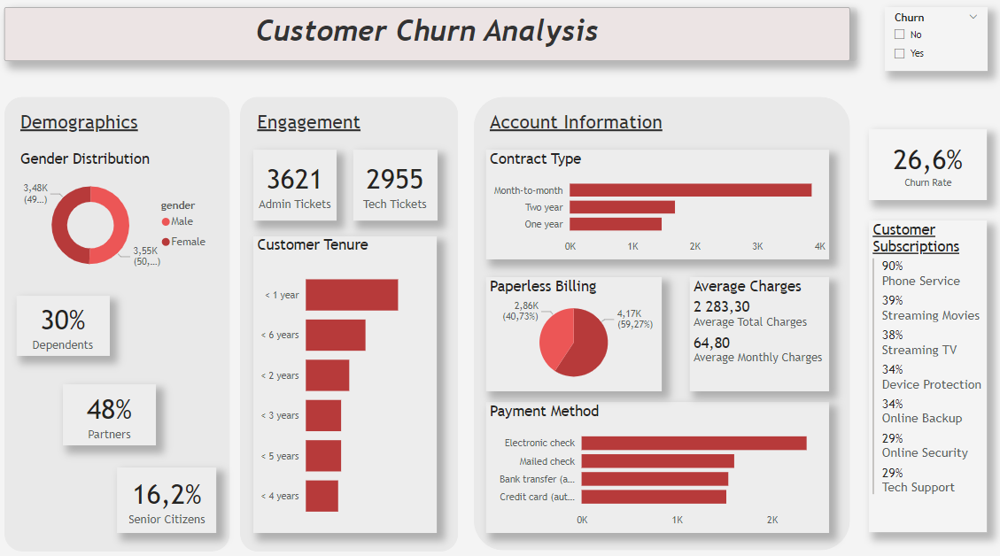
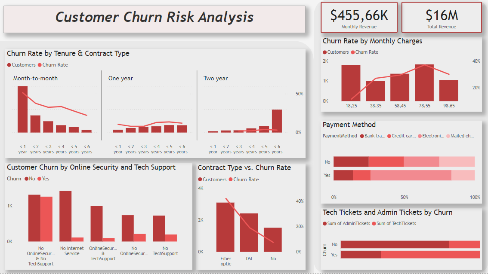

# Customer Churn

## Introduction
This project is part of the [Forage PwC Switzerland Power BI Job Simulation](https://www.theforage.com/simulations/pwc-ch/power-bi-cqxg). The aim of this dashboard is to provide insights into customer churn, helping stakeholders understand customer demographics, account information, and potential risks of churn.

The first page, **Customer Churn Analysis**, focuses on an overview of the data through various charts, primarily highlighting customer demographics, account information, and details about subscriptions and additional services. The second page, titled **Customer Churn Risk Analysis**, delves into analyzing the risk of a customer leaving (churn). It presents key differences between customers who churn and those who do not.

## Dataset Description
The dataset includes the following columns:

- **customerID**: Unique identifier for each customer
- **gender**: Gender of the customer (Male, Female)
- **SeniorCitizen**: Indicates whether the customer is a senior citizen (1 = Yes, 0 = No)
- **Partner**: Indicates whether the customer has a partner (Yes/No)
- **Dependents**: Indicates whether the customer has dependents (Yes/No)
- **tenure**: Number of months the customer has been with the company
- **PhoneService**: Indicates whether the customer has phone service (Yes/No)
- **MultipleLines**: Indicates whether the customer has multiple lines (Yes/No)
- **InternetService**: Type of internet service (DSL, Fiber optic, No)
- **OnlineSecurity**: Indicates whether the customer has online security (Yes/No)
- **OnlineBackup**: Indicates whether the customer has online backup (Yes/No)
- **DeviceProtection**: Indicates whether the customer has device protection (Yes/No)
- **TechSupport**: Indicates whether the customer has tech support (Yes/No)
- **StreamingTV**: Indicates whether the customer has streaming TV (Yes/No)
- **StreamingMovies**: Indicates whether the customer has streaming movies (Yes/No)
- **Contract**: Type of contract (Month-to-month, One year, Two year)
- **PaperlessBilling**: Indicates whether the customer has paperless billing (Yes/No)
- **PaymentMethod**: Method of payment (Electronic check, Mailed check, Bank transfer, Credit card)
- **MonthlyCharges**: Monthly charges for the customer
- **TotalCharges**: Total charges for the customer
- **numAdminTickets**: Number of administrative tickets raised by the customer
- **numTechTickets**: Number of technical tickets raised by the customer
- **Churn**: Indicates whether the customer has churned (Yes/No)

## Data Transformation
In order to clean the data I have used Power Query to check for errors or empty fields:
- Power Query -> View -> Column Distribution & Column Quality.
- Removed empty values from the **Total Charges** column.

## Measures

1. **Churn Rate**:
    ```dax
    Churn Rate = 
    DIVIDE(
        CALCULATE(COUNT('01 Churn-Dataset'[Churn]), '01 Churn-Dataset'[Churn] = "yes" ),
        COUNT('01 Churn-Dataset'[Churn]), 0)
    ```
    
2. **Dependents in %**:
    ```dax
    Dependents in % = 
    DIVIDE(
        CALCULATE(COUNT('01 Churn-Dataset'[customerID]), '01 Churn-Dataset'[Dependents] = "Yes"),
        COUNT('01 Churn-Dataset'[customerID])
    )
    ```
    
3. **Partners in %**:
    ```dax
    Partners in % = 
    DIVIDE(
        CALCULATE(COUNT('01 Churn-Dataset'[customerID]), '01 Churn-Dataset'[Partner] = "Yes"),
        COUNT('01 Churn-Dataset'[customerID])
    )
    ```
4. **Tenure in Years**:
    ```dax
    Tenure in years = 
    SWITCH(TRUE(),
        '01 Churn-Dataset'[tenure] <= 12, "< 1 year",
        '01 Churn-Dataset'[tenure] <= 24, "< 2 years",
        '01 Churn-Dataset'[tenure] <= 36, "< 3 years",
        '01 Churn-Dataset'[tenure] <= 48, "< 4 years",
        '01 Churn-Dataset'[tenure] <= 60, "< 5 years",
        '01 Churn-Dataset'[tenure] <= 72, "< 6 years"
    )
    ```

For variables such as **Phone Service**, **Streaming Movies**, **Streaming TV**, and **Device Protection** a measure was created to display them in % using the following formula:

5. **Service Name in %**:
    ```dax
    ServiceName in % = 
    DIVIDE(
        CALCULATE(COUNT('01 Churn-Dataset'[customerID]), '01 Churn-Dataset'[ServiceName] = "Yes"),
        COUNT('01 Churn-Dataset'[customerID])
    )
    ```
  
## Customer Churn Analysis Page



The page features a **card visual** that displays the **Churn Rate** and includes a slicer to filter customers by churn status (Yes/No).

## 1) Demographics
The first section focuses on the demographics of customers. It includes the following visualizations:

- **Donut Chart**: Displays the gender distribution of customers.

- **Card Visuals**: Three card visuals represent the percentages of customers with dependents, partners, and senior citizens. These visuals are created using the following formulas:

## 2) Engagement
The next section provides insights into customer engagement:

- **Card Visuals**: Two card visuals display the number of technical tickets (TechTickets) and administrative tickets (Admin Tickets).

- **Bar Chart**: A bar chart titled **Customer Tenure** presents the duration of customer relationships, utilizing a calculated column to convert tenure from months to years. The formula used is:

## 3) Account Information
The next section focuses on the account information of customers, including the following visualizations:

- **Bar Chart**: Displays the distribution of customers by **Contract Type**.

- **Pie Chart**: Shows the proportion of customers with **Paperless Billing** (Yes/No).

- **Multi-row Card**: Provides insights into the **Average Monthly Charges** and **Average Total Charges** for customers.

- **Bar Chart**: Represents the different **Payment Methods** utilized by customers.


## 4) Customer Subscription
This section includes a **multi-row card** displaying categorical variables related to customer subscriptions, such as **Phone Service**, **Streaming Movies**, **Streaming TV**, and **Device Protection** in %. 

## 5) Insights

1. **The customer base is evenly distributed by gender.**

2. **The most common tenure period is under 1 year, followed by a tenure of under 6 years.**

3. **The majority of customers have month-to-month contracts.**

4. **Electronic check is the most commonly used payment method.**

5. **The overall churn rate is 26.6%.**


## Customer Churn Risk Analysis Page




## 1) Churn Rate by Tenure & Contract Type
- **Visual Type**: Line and Column Chart with Small Multiples by Contract Type
- **Insights**:
  - **Month-to-Month Contracts**: Customers with a month-to-month contract have the **highest churn rate**, especially within the first year of tenure.
  - **Two-Year Contracts**: The churn rate for customers with two-year contracts remains consistently low, not exceeding 5%.

## 2) Churn Rate by Internet Service
- **Visual Type**: Line and Column Chart
- **Insights**:
  - **Fiber Optic Service**: This service type has the **highest churn rate**, exceeding 40%.
  - **No Internet Service**: Customers without internet service have a significantly lower churn rate.

## 3) Customer Churn by Online Security and Tech Support
- **Visual Type**: Clustered Column Chart
- **Internet Category Combined**: A new column combining Online Security and Tech Support was created using the following logic:

  ```powerquery
  InternetCategoryCombined = 
  SWITCH(
      TRUE(),
      '01 Churn-Dataset'[OnlineSecurity] = "No" && '01 Churn-Dataset'[TechSupport] = "No", "No OnlineSecurity & No TechSupport",
      '01 Churn-Dataset'[OnlineSecurity] = "No", "No OnlineSecurity",
      '01 Churn-Dataset'[TechSupport] = "No", "No TechSupport",
      '01 Churn-Dataset'[OnlineSecurity] = "No internet service" || '01 Churn-Dataset'[TechSupport] = "No internet service", "No Internet Service",
      "OnlineSecurity & TechSupport"
  )
  ```
- **Insights**:
  - **Low Churn**: Customers without internet service have a low churn rate.
  - **High Churn**: Among customers with internet service, those without any support features (e.g., Online Security or Tech Support) have the highest churn rates.
  - **Recommendation**: Offering supportive features such as Online Security or Tech Support to internet customers may reduce churn.
 
## 4) Churn Rate by Monthly Charges
- **Visual Type**: Line and Column Chart
- **Insights**:
  - **High Churn**: Monthly charges in the range of $70-$100 are associated with a high churn rate (~35%).
  - **Lower Churn**: Customers with monthly charges under $35 experience a  lower churn rate as well as customers with monthly charges in ranege $50-$70.

## 5) Payment Method by Churn
- **Visual Type**: 100% Stacked Bar Chart
- **Insights**:
  - **Electronic Check**: Over 50% of customers who churn use the electronic check payment method.

## 6) Tech Tickets and Admin Tickets by Churn
- **Visual Type**: 100% Stacked Bar Chart
- **Insights**:
  - **Churned Customers**: These customers have twice as many tech tickets compared to admin tickets.
  - **Non-Churned Customers**: Conversely, non-churned customers have more admin tickets than tech tickets.

## 7) Card Visuals - Monthly Revenue, Total Revenue
- **Functionality**:
  - These card visuals display monthly and total revenue, allowing users to see the revenue generated by each group when interacting with other visuals.

