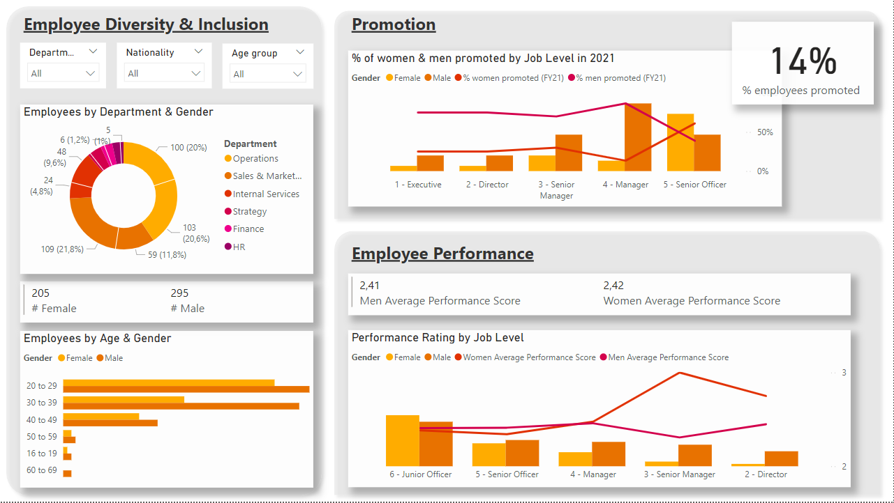
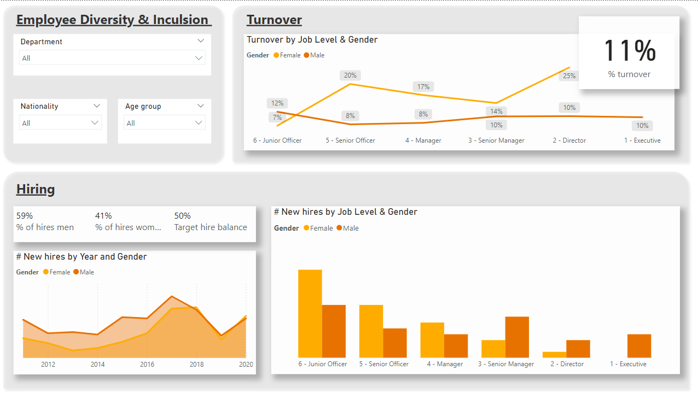
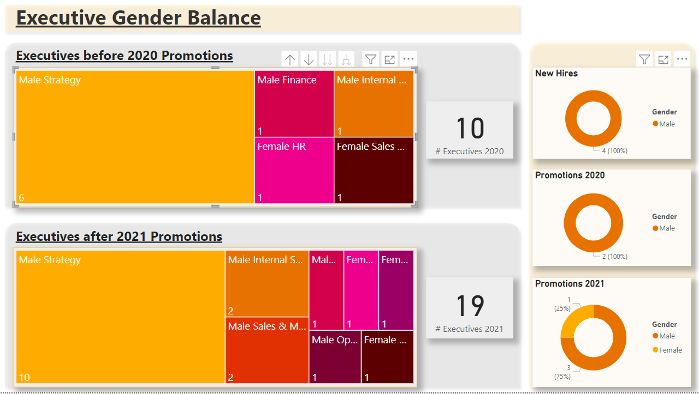

# Employee Diversity & Inclusion Dashboard

## Introduction
This project is a part of the [Forage PwC Switzerland Power BI Job Simulation](https://www.theforage.com/simulations/pwc-ch/power-bi-cqxg). The **Employee Diversity & Inclusion** dashboard focuses on creating visualizations for HR data, particularly gender-related KPIs, to identify root causes for the slow progress in achieving gender balance at the executive management level. 

**Goals**
- Visualize HR data, with a focus on gender-related KPIs.
- Explore and discuss the potential reasons behind the lack of gender balance at the executive management level.

## Measures

Below is a list of key measures used in the dashboard for various calculations:

1. **# Female**
   ```DAX
   # Female = CALCULATE(COUNT('Pharma Group AG'[Employee ID]), 'Pharma Group AG'[Gender] = "Female")
   ```

2.  **# Male**
   ```DAX
   # Male = CALCULATE(COUNT('Pharma Group AG'[Employee ID]), 'Pharma Group AG'[Gender] = "Male")
   ```

3. **# Leavers**
   ```DAX
   # leavers = CALCULATE(COUNT('Pharma Group AG'[Employee ID]), 'Pharma Group AG'[FY20 leaver?] = "Yes")
   ```
   
4. **% Employees Promoted (FY21)**
   ```DAX
   % employees promoted (FY21) = DIVIDE(
       CALCULATE(COUNT('Pharma Group AG'[In base group for Promotion FY21]), 'Pharma Group AG'[Promotion in FY21?] = "Yes"), 
       CALCULATE(COUNT('Pharma Group AG'[Promotion in FY21?]), 'Pharma Group AG'[In base group for Promotion FY21] = "Yes"))
   ```

5. **% Men Promoted (FY21)**
   ```DAX
   % men promoted (FY21) = DIVIDE(
       CALCULATE(COUNT('Pharma Group AG'[In base group for Promotion FY21]), 'Pharma Group AG'[Promotion in FY21?] = "Yes", 'Pharma Group AG'[Gender] = "Male"),      
       CALCULATE(COUNT('Pharma Group AG'[Promotion in FY21?]), 'Pharma Group AG'[In base group for Promotion FY21] = "Yes"))
   ```
   
6. **% Women Promoted (FY21)**
   ```DAX
   % women promoted (FY21) = DIVIDE(
       CALCULATE(COUNT('Pharma Group AG'[In base group for Promotion FY21]), 'Pharma Group AG'[Promotion in FY21?] = "Yes", 'Pharma Group AG'[Gender] = "Female"),      
       CALCULATE(COUNT('Pharma Group AG'[Promotion in FY21?]), 'Pharma Group AG'[In base group for Promotion FY21] = "Yes"))
    ```

7. **% of Hires Men**
   ```DAX
   % of hires men = DIVIDE( [# Male], [# Female] + [# Male] )
   ```
   
8. **% of Hires Women**
   ```DAX
   % of hires women = DIVIDE( [# Female], [# Female] + [# Male] )
   ```
   
9. **% Turnover**
   ```DAX
   % turnover = DIVIDE(
       [# leavers], 
       CALCULATE(COUNT('Pharma Group AG'[FY20 leaver?]), 'Pharma Group AG'[In base group for turnover FY20] = "Y"))
    ```

10. **Avg Performance Rating FY20 Men**
    ```DAX
    AvgPerfRating FY20 Men = CALCULATE(AVERAGE('Pharma Group AG'[FY20 Performance Rating]), 'Pharma Group AG'[Gender] = "Male")
    ```

11. **Avg Performance Rating FY20 Women**
    ```DAX
    AvgPerfRating FY20 Woman = CALCULATE(AVERAGE('Pharma Group AG'[FY20 Performance Rating]), 'Pharma Group AG'[Gender] = "Female")
    ```

## Dashboard Structure

The project is divided into 3 main pages:

### 1. Employee Promotion and Performance
This page analyzes employee promotion trends and performance ratings across genders and job levels.



#### a. **Overview**
- **Visuals**: 
  - Donut Chart: Employees by department.
  - Multi-row Card: Number of Females & Males.
  - Clustered Bar Chart: Employees by Age and Gender.
  - 3 Slicers: Department, Age Group, Nationality.
  
#### b. **Promotion**
- **Visual**: Line & Clustered Column Chart: Percentage of men and women promoted by Job Level.
- **Insights**:
  - Higher job levels (1. Executive - 4. Manager) show a strong promotion bias towards men.
  - At the 5th level (Senior Officer), more women are promoted than men.
- **Additional**: A card visual displays the overall percentage of promoted employees.

#### c. **Employee Performance**
- **Visual**: Line & Clustered Column Chart: Performance ratings by Job Level.
- **Insights**:
  - Average ratings for lower job levels (6. Junior Officer - 4. Manager) are similar for men and women.
  - For higher job levels, women's average rating exceeds men's.
- **Additional**: Multi-row Card displays overall average ratings for men and women.

### 2. Employee Turnover & Hiring

This page focuses on analyzing turnover rates and hiring trends across genders and job levels.



#### a. **Turnover**
- **Visual**: Line Chart: Turnover by Job Level and Gender.
- **Insights**: 
  - Turnover is higher for females than males in most job levels, except for level 6 (Junior Officer), where male turnover is slightly higher.
- **Additional**: A card visual shows the overall turnover rate.

#### b. **Hiring**
- **Visuals**: 
  - Area Chart: Number of New Hires by Year and Gender.
  - Clustered Column Chart: New Hires by Job Level and Gender.
- **Insights**: 
  - Until 2017, the company hired significantly more men than women. This trend reversed slightly in 2018, with the number of women hires exceeding men.
  - For lower job levels (6. Junior Officer - 4. Manager), more women were hired, while for higher levels, more men were hired.
- **Additional**: A multi-row card shows the percentage of hired women compared to men and the target balance of 50%.

---

### 3. Executive Gender Balance

This page analyzes the gender disparity among executives, focusing on changes from 2020 to 2021.



- **Executives before 2020 Promotions / Executives after 2021 Promotions**:
  - **Visuals**: 
    - Treemap: Executives by Department.
    - Card Visual: Total number of executives.
  - **Insights**: 
    - At the start of 2020, there were 10 executives across 5 departments, with the biggest gender imbalance in the Strategy department (6 men, 0 women).
    - After 2021 promotions, the number of executives grew to 19 (16 men, 3 women). The Strategy department remained all male, with 10 executives.
  
- **Additional Visuals**:
  - 3 Donut Charts: 
    - New Hires by Gender.
    - Promotions in 2020 by Gender.
    - Promotions in 2021 by Gender.
    
- **Conclusions**: 

  - The gender imbalance at the executive level is highly visible, with significant disparities in leadership roles. In 2020, there were 10 executives across 5 departments, with no female representation in key areas like the Strategy department (6 men, 0 women).
    
  - By 2021, the number of executives increased to 19, but the gender imbalance remained stark, with 16 men and only 3 women at the executive level. The Strategy department continued to have an all-male leadership team of 10 executives.
  
  - During the period from 2020 to 2021, only one woman was promoted to the executive level compared to five men, indicating very slow progress in addressing gender disparities.
  
  - While there is evidence of incremental change, the slow pace of promotions for women highlights the need for more proactive and targeted efforts to achieve gender balance at the executive level. Addressing this issue requires further organizational actions, such as establishing clear gender diversity goals, developing mentorship programs for women, and fostering a more inclusive promotion process to ensure balanced representation at senior leadership levels.


